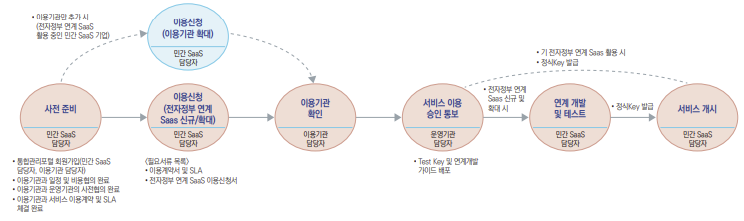

## 전자정부 연계 SaaS

### 전자정부 연계 SaaS 이용 절차

#### 1. 모바일공무원인증
- (정의) 모바일 공무원 인증 시스템은 DID(Decentralized Identified) 기술이 적용된 자기주권 신원증명 시스템.
- (구성도) QR 방식과 PUSH 방식을 이용하여 모바일 공무원 인증 시스템을 사용하여 민간 SaaS 로그인
- (API) 인증 방식에 따라 API가 구분. Restful API 방식을 사용하며 Session값을 사용하여 로그인 여부를 확인하므로 Session값 필요

#### 2. 사용자·조직도 정보 (LDAP)
- (정의) 정부기관과 공공기관 및 민간기관의 조직정보와 직원정보를 조직도 형태로 제공하여 행정정보시스템이 수시로 참조하여 활용할 수 있도록 서비스를 제공하는 기반 시스템. 정부기관과 공공기관 등의 조직정보, 직원정보를 조회할 수 있는 서비스
- (API) Restful API 방식을 사용하여 데이터 제공. API 키를 활용하여 인가된 사용자·조직도SaaS 사용자 검증
- (정보공개) 중앙행정기관 및 지자체 사용자 ·조직도 정보 제공. 홈페이지에 공개된 정보에 한하여 기관명, 성명, 직급, 직위를 제공. 제공된 데이터가 null인 경우는 공개등급에 따라 제공할 수 없는 정보임.

#### 3. 행정표준코드
- (정의) 행정기관 간 행정정보의 원활한 공동이용을 도모하기 위하여 각급 기관의 행정업무에 필요한 행정코드를 표준화하여 정해진 절차에 따라 제정, 고시한 행정코드를 제공하는 서비스
- (API) Restful API 방식을 사용하여 데이터 제공. API에 코드 종명을 매개변수로 받아 코드 종에 해당하는 데이터를 반환하는 방식으로 진행
- (활용예시)
  - 기관 코드를 연계하여 JSON 구조의 조직도 정보 생성
  - 행정표준코드 중 직위/직급/직무 등의 표준코드를 연계한 후, 직위/직급별 분류를 통해 사용 권한 부여

#### 4. GPKI (추가예정)
- (정의) 중앙 및 지방 행정 기관에 종사하는 공직자들이 민간 SaaS에 로그인 시, GPKI 인증서를 통해 로그인을 할 수 있도록 인증서 검증을 연계하는 서비스
- (API) Restful API 방식으로 인증서 로그인을 수행하며, 인증서폐지목록(CRL)을 확인하는 방식으로 인증서를 검증
