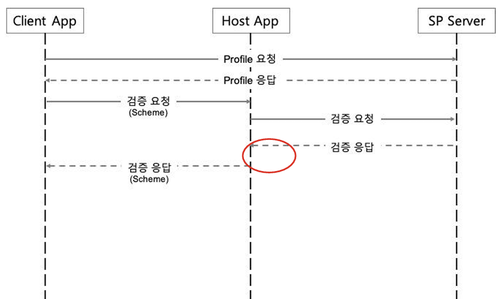
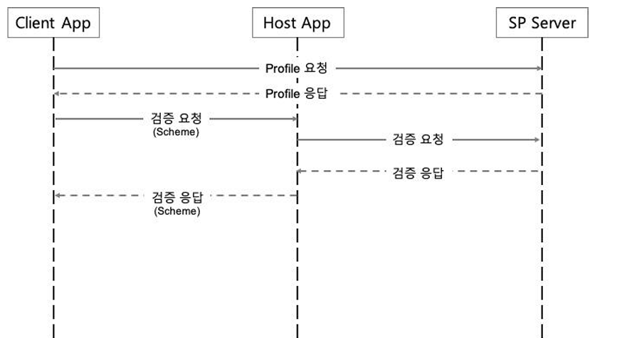

## 모바일공무원인증 - App To App 가이드
- 모바일 공무원증 App to App 가이드는 Mobile Web Browser에서 모바일 공무원증 Application 호출하는 방법만 안내합니다.
- 이용기관에서는 적용하는 정책(지원하는 디바이스, 지원하는 브라우저 등)에 따라서 모바일 Web To App을 적용하여 주시기 바랍니다.
- CSS, javascript, Angular, React, Vue.js 등의 browser에서 발생하는 오류는 기술 지원해드릴 수 없음을 알려드립니다.


---

## App to App 모바일공무원인증 사용 API 목록

| 요청 URL                        | 메서드  | 응답 형식 | 설명                                            |
|-------------------------------|------|-----------|-----------------------------------------------|
| /oauth2/authorize             | GET  | JSON      | 연계 SaaS에게 권한 인증을 요청하는 API                     |
| /oauth2/token                 | POST | JSON      | 연계 SaaS에 Access Token/Refresh Token을 요청하는 API |
| /oauth2/userinfo              | GET  | JSON      | 로그인 한 사용자의 정보를 요청하는 API                       |
| /oauth2/connect/logout        | GET  | JSON      | 로그인 한 사용자의 토큰을 만료시키는 API                      |
| /auth/spnoneprofile/mbTxCheck | POST | JSON      | 검증 완료 여부를 확인 요청하는 API                         |
| /auth/login                   | POST | JSON      | 검증 완료된 사용자의 로그인 확인 여부를 요청하는 API               |

※ authorize, mbTxCheck, login 을 제외한 API는 모바일 공무원증 파일을 확인하시기 바랍니다.

### (1) Authorization Code 요청
- 앱 로그인(App to App) 요청 파라미터

| 파라미터명                | 입력값              | 비고(예시)                             |
|:---------------------|:-----------------|:-----------------------------------|
| response_type        | code             | 고정값                                |
| scope                | openid           | 고정값                                |
| client_id            | 지정한 client_id    | 연계서비스ID (ex: LKSV2099010119000196) |
| redirect_uri         | 지정한 redirect_uri | 민간SaaS.com/oauth/callback          |
| state                | 랜덤 문자열           |                                    |
| nonce                | 랜덤 문자열           |                                    |
| codeChallenge        | 랜덤 문자열           | codeVerifier 변환 값                  |
| codeChallengeMethod  | S256             | 고정값                                |

** 고정값: 문자 그대로 입력(ex: code, openid, S256)

- 요청 예시
```
  <요청 URI 예시>
  https://www.saas.go.kr/auth/oauth2/authorize?
  response_type=code&
  scope=openid&
  client_id=연계서비스ID&
  redirect_uri=민간SaaS.com/oauth/callback&
  state=gdyV_sdDS6VAFObL8WRBl&
  nonce=BVUPBg5OmnGsAUceNsDUh
  code_challenge=uMqonp-nxOMeEHHkL3GS8cD39MqqjXKGwk631dKDbfc
  code_challenge_method=S256
```  

- 응답 예시
```
 { 
    "type": "VERIFY", //고정값
    "spDid": "did:omn:3eYAoCcxgbVNNTxeSQXeo6Y3MbhQ", 
    "serviceCode": "spdriver", //민간 SaaS 서비스코드 
    "callBackUrl": "https://www.saas.go.kr/auth/spnoneprofile/verify",//고정값 
    "nonce": "988cef69d625e4db508b6b78151cabf59ad63da386a0d2f2b5e269037478f460", 
    "encryptType": 2  //고정값
 } 
```

- 프로세스
    - 로그인 버튼 클릭 시 QR 로그인 데이터 반환, 모바일 공무원증 앱 열기
    - 검증 완료 후 돌아온 화면에서 검증 완료 확인 요청
    - 로그인이 확인 요청
    - 로그인이 되어 있는 경우 즉시 redirect_uri 페이지로 이동한다.

- 사후 처리
    - Redirection URI에서 취득한 Authorization Code를 사용하여 Token을 발급받는다.

## (2) App to App 구현 (Android)
### 2.1 Host App 호출정보
| Client App                | 설정 값                   |
|---------------------------|:-----------------------|
 Client App에서 사용할 Scheme 값 | Bmc                    |
| Client App에서 사용할 Action 값 | kr.go.id.bmc.VERIFY_VP |

### 2.2 Client App 과 Host App 간의 SequenceDiagram


### 2.3 App to App 연동 Flow
#### 2.3.1 로그인 요청 응답 받은 결과 값을 사전 정의된 Scheme를 통해 Host App으로 전달

※ appName=barotalk 은 Client App에서 정의된 앱 이름을 의미함
```
    ① ActivityResultLauncher<Intent> resultLauncher;
    ② resultLauncher = registerForActivityResult(new ActivityResultContracts.StartActivityForResult(),
    activityResultCallback);
    ③ Uri uri = Uri.parse("bmc://verify_vp?appName=barotalk
                            &type=VERIFY
                            &spDid=did:omn:3eYAoCcxgbVNNTxeSQXeo6Y3MbhQ
                            &serviceCode=spdriver
                            &callBackUrl=https://www.saas.go.kr/auth/spnoneprofile/verify
                            &nonce=988cef69d625e4db508b6b78151cabf59ad63da386a0d2f2b5e269037478f460
                            &encryptType=2”);
    ④ Intent intent = new Intent("kr.go.id.bmc.VERIFY_VP", uri);
    ⑤ resultLauncher.launch(intent);
```
①  Activity 전역에 런처 클래스 선언

② onCreate() 실행 시 런처 등록

③ Host App 에서 검증시 사용할 데이터

④ Host App AndroidManifest.xml 에 정의된 Action 값.

⑤ Host App 호출
#### 2.3.2 Host App에서 검증 결과를 Client App 으로 전달
```
결과 예시) bmc://verify_vp?result=true&code=200&message=success&errorMsg=

ActivityResultCallback<ActivityResult> activityResultCallback = new ActivityResultCallback<ActivityResult>() {
  @Override
  public void onActivityResult(ActivityResult result) {
    int resultCode = result.getResultCode();
    if (resultCode == RESULT_OK) {
      Intent data = result.getData();
      if (data != null) {
        ①String strResult = data.getData().getQueryParameter("result");
        ②if ("true".equals(strResult)) {
          // Success 처리
          Log.i("TAG", "success");
        } else {
          // Fail 처리
          Log.i("TAG", "fail");
        }
      }
    }
  }
};
```

①  Host App 에서 결과 값으로 전달한 파라미터.

②  Client App 에서 결과 처리 

## (3) App to App 구현 (iOS)
### 3.1 Host 및 Client App 준비 사항
#### 3.1.1 Project info.plist에 URL types 정의
- 유니크한 Identifier값을 설정합니다. URL Schemes에 해당앱의 scheme을 설정합니다. (불려질 앱의 이름)

```
  <key>CFBundleURLTypes</key> 
  <array> 
  <dict> 
    <key>CFBundleURLName</key> 
    <string>유니크한 Identifier 값 설정</string> 
    <key>CFBundleURLSchemes</key> 
    <array> 
      <string>유니크한 scheme 설정(불려질 앱의 이름)</string> 
    </array> 
  </dict> 
  </array> 
```
- canOpenURL 메소드를 사용하여 앱 호출가능 여부를 체크할 경우할 경우 
- info.plist에 LSApplicationQueriesSchemes 배열에 해당 앱을 부를 앱의 scheme을 추가
  canOpenURL을 호출하지 않고 바로 openURL을 사용하여도 무방합니다.

### 3.2 Client App과 Host App 간의 SequenceDiagram


### 3.3 App to App 연동 Flow
#### 3.3.1 로그인 요청 응답 받은 결과 값을 사전 정의된 Scheme를 통해 Host App으로 전달
※이하 예제의 “barotalk”은 CFBundleURLSchemes에서 설정한 값으로 변경 필요

objective-c

```
  ① NSString* scheme = @"bmc://verify_vp?appName=barotalk 
                        &type=VERIFY 
                        &spDid=did:omn:3eYAoCcxgbVNNTxeSQXeo6Y3MbhQ 
                        &serviceCode=spdriver 
                        &callBackUrl=http://1.214.64.23:8081/omniapi/vc/v2/verifyQR 
                        &nonce=988cef69d625e4db508b6b78151cabf59ad63da386a0d2f2b5e269037478f460 
                        &encryptType=2”; 
  ② NSURL *urlScheme = [[NSURL alloc] initWithString:scheme]; 
  ③ if (@available(iOS 10.0, *)) { 
    [[UIApplication sharedApplication] openURL:urlScheme options:@{} completionHandler:^(BOOLsuccess) { 
      if (success) { NSLog(@"success"); } 
          }]; 
    } else { 
      [[UIApplication sharedApplication] openURL:urlScheme]; 
    } 
```

Swift
```
  ① let scheme = "bmc://verify_vp?appName=barotalk 
                   &type=VERIFY 
                   &spDid=did:omn:3eYAoCcxgbVNNTxeSQXeo6Y3MbhQ 
                   &serviceCode=spdriver 
                   &callBackUrl=http://1.214.64.23:8081/omniapi/vc/v2/verifyQR 
                   &nonce=988cef69d625e4db508b6b78151cabf59ad63da386a0d2f2b5e269037478f460 
                   &encryptType=2” 
  ② let urlScheme = URL.init(string : scheme) 
  ③ if #available(iOS 10.0, *) { 
        UIApplication.shared.open(urlScheme, options:[:]){(success) in 
          if success {print(“success”)} 
        } 
    } else { 
        UIApplication.shared.openURL(urlScheme) 
    }
```

① Host App 에서 검증시 사용할 데이터

③  URL 형태로 변환

③ OS 버전 체크 후 Host App 호출

#### 3.3.2 Host App에서 검증 결과를 Client App 으로 전달
※이하 예제의 “barotalk”은 CFBundleURLSchemes에서 설정한 값으로 변경 필요

AppDelegate.m (objective-c)

- 결과 예시) barotalk://verify_vp?result=(boolean)&code=(code)&message=(message)&errorMsg=(errorMsg) - (BOOL)application:(UIApplication *)app openURL:(NSURL *)url
``` 
options:(NSDictionary<UIApplicationOpenURLOptionsKey,id> *)options {    
  NSURLComponents *urlComponents = [NSURLComponents componentsWithURL:url 
  resolvingAgainstBaseURL:NO]; 
  if (① [urlComponents.host isEqualToString:@"verify_vp"] && urlComponents.queryItems != nil && 
    urlComponents.queryItems.count > 0) { 
      NSArray *queryItems = [urlComponents queryItems]; 
              NSMutableDictionary *dict = [NSMutableDictionary new]; 
      for (NSURLQueryItem *item in queryItems) { 
      [dict setObject:[item value] forKey:[item name]]; 
    } 
    if (③ [②[dict valueForKey:@"result"] isEqualToString:@"true"]) { 
      // Success 처리 
    } else { 
      // Fail 처리 
    } 
  } 
} 
```

AppDelegate.swift (swift)

- 결과 예시) barotalk://verify_vp?result=(boolean)&code=(code)&message=(message)&errorMsg=(errorMsg) 
``` 
public func application(_ app: UIApplication, open url: URL, options: [UIApplication.OpenURLOptionsKey : 
Any] = [:]) -> Bool { 
    let urlComponents = URLComponents(url : url, resolvingAgainstBaseURL:false)! 
    if ①let host = urlComponents.host, host == “verify_vp”, let items = urlComponents.queryItems, 
    items.count > 0 { 
           if ②let result = items[“result”], ③result.value == “true” { 
            // Success 처리 
          } else { 
            // Fail 처리 
          } 
    } 
}  
```

## (4) 로그인 인증 검증 요청
- 요청 방식 : Redirection URI
- 요청 URI : /auth/spnoneprofile/mbTxCheck
- 웹 로그인 요청 파라미터

| 파라미터명                | 입력값              | 비고(예시)                             |
|:---------------------|:-----------------|:-----------------------------------|
| codeVerifier | 랜덤 문자열 | 로그인 요청 시 codeChallenge 변환에 사용했던 codeVerifier|
** 고정값: 문자 그대로 입력(ex: code, openid)

- 요청 예시
```
  <요청 URI 예시>
  https://www.saas.go.kr/auth/spnoneprofile/mbTxCheck?code_verifier=랜덤 문자열
```  

- 응답 예시
```
 ex) 검증 완료값
 {
   "result":true,
   "code":200,
   "message":"success",
   "errorMsg":null,
   "txCompleteCode":"COMPLETE",
   "csrfToken":null,
   "qrData":null,
   "qrKey": 로그인 시 생성된 QrKey,
   "nonce":"988cef69d625e4db508b6b78151cabf59ad63da386a0d2f2b5e269037478f460",
   "cn": 사용자의 CN값
 }
```

## (5) 로그인 검증 요청
- 요청 방식 : Redirection URI
- 요청 URI : /auth/login
- 웹 로그인 요청 파라미터

| 파라미터명    | 입력값   | 비고(예시)               |
|:---------|:------|:-----------------------------|
| username | cn    | 로그인 인증 검증 완료 시 리턴된 cn|
| password | nonce | 로그인 인증 검증 완료 시 리턴된 nonce|

- 응답 예시

Redirection URI
[지정한 redirect_uri]?code=[Authorization Code]&state=[입력한 state]
```
  예시)
  https://민간SaaS.com(지정한 redirect_url) /oauth/callback?
  code=sMTesyQ8…kGxT-65FNcQnqji28qG4n&
  state=gdyV_sdDS6VAFObL8WRBl
```


```
※ 사전 조사
- client_id, client_secret, redirect_uri, post_logout_redirect_uri 등이 연계SaaS DB에 저장된다.
- client_id, client_secret은 이용신청 승인 이후 통합관리포털에서 발급된다. (client_id: 연계서비스ID, client_
  secret: API Key)
- redirect_uri, post_logout_redirect_uri은 통합관리포털에서 이용신청 시 입력한다. (여러 개 입력 가능, 입력
  후 수정 불가)
- 잘못된 client_id, client_secret으로 요청하거나 등록되지 않은 redirect_uri를 입력하면 정상적으로 서비스가
  제공되지 않음에 유의해야 한다.
```
