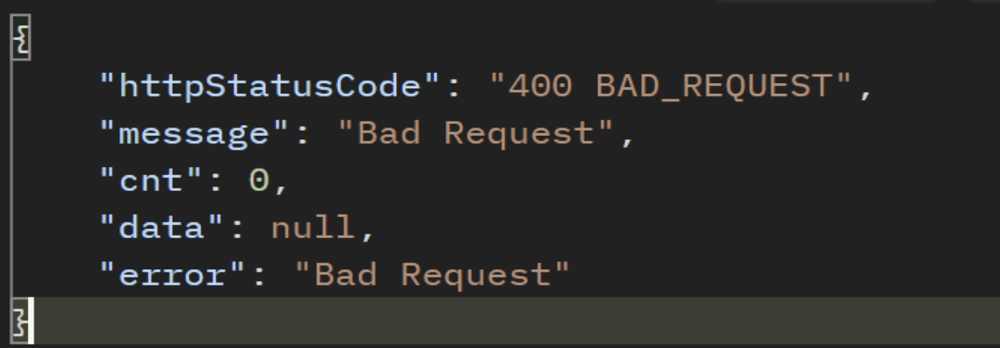
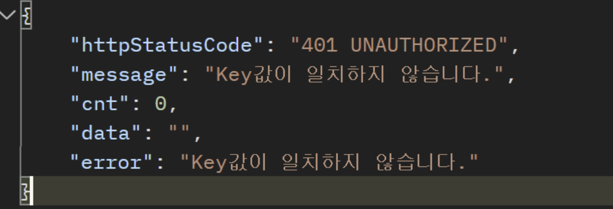
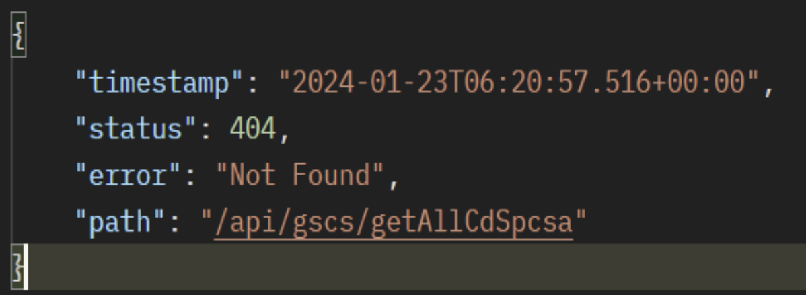
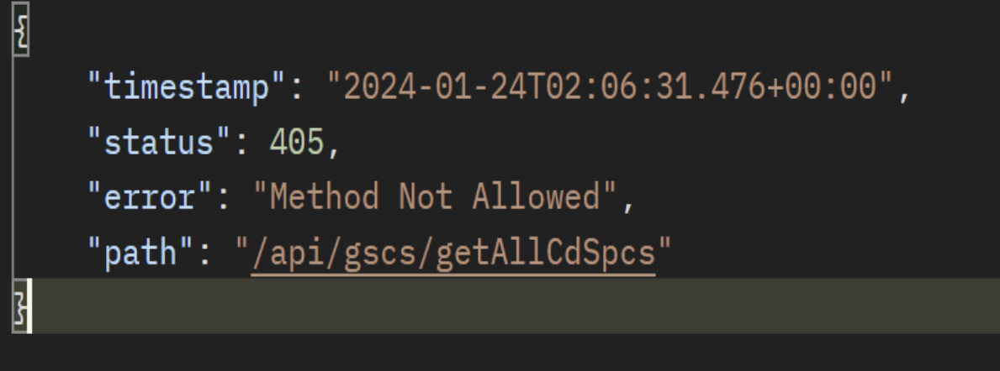
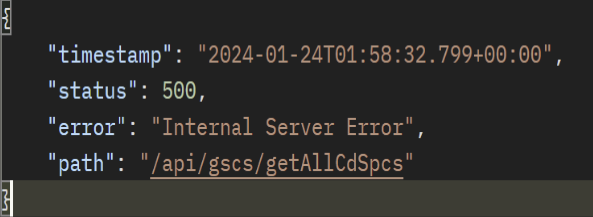

## 주요 오류 코드

| HTTP 상태 코드       | 오류 발생 원인                                                   |
|------------------|------------------------------------------------------------------|
| 400 (요청변수 확인)    | 필수 요청 변수가 없거나 요청 변수 이름이 잘못된 경우    |
| 401 (인증실패)       | API 권한이 설정되지 않은 경우                             |
| 401 (인증실패)       | 접근 토큰이 없거나 잘못된 값을 설정한 경우                |
| 404 (API 없음)     | API 접근 URL을 잘못된 경우                                |
| 405 (HTTP 요청 오류) | 잘못된 HTTPS 요청을 보낸 경우 (GET, POST)         |
| 500 (서버 오류)      | API 호출은 정상적으로 했지만 API 서버 유지보수나 시스템 오류로 인한 오류가 발생한 경우 |

---
### (1) 400 (요청변수 확인)

### (2) 401 (인증실패)

### (3) 404 (API없음 – path 확인 필요

### (4) 405 (HTTP요청오류)

### (5) 500 (서버오류)
